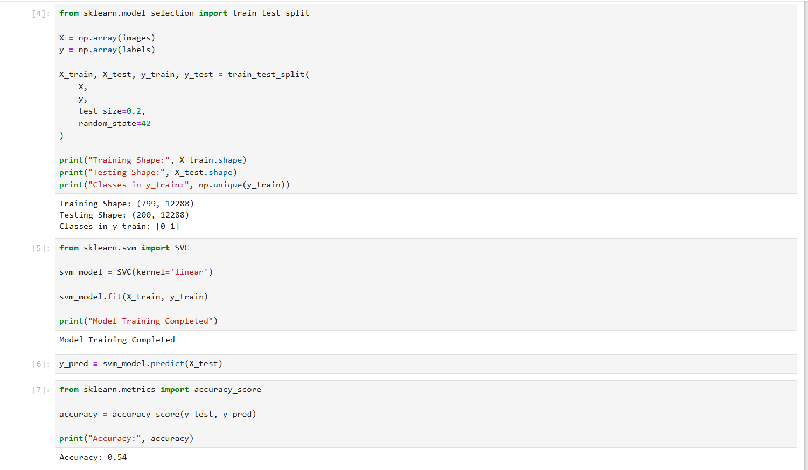
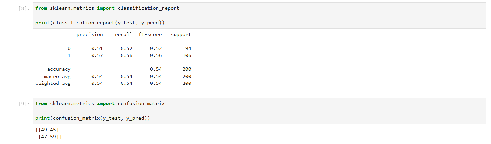
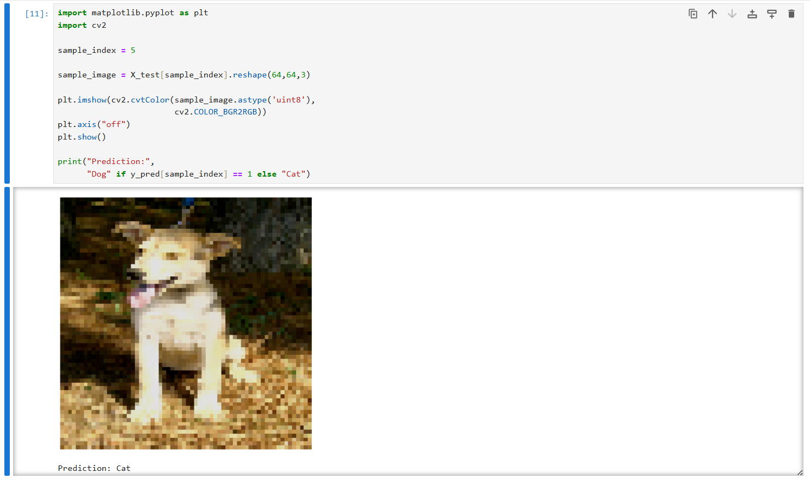

# Dogs vs Cats Image Classification using Support Vector Machine (SVM)

## 📌 Overview

This project was completed as part of the **Prodigy InfoTech Machine Learning Internship – Task 03**. The objective is to classify images of cats and dogs using a Support Vector Machine (SVM) model.

The project involves image preprocessing, feature extraction, model training, prediction, and evaluation.

---

## 📂 Dataset

**Dataset:** Microsoft PetImages Dataset

Categories:

* Cat Images
* Dog Images

Images were resized and converted into feature vectors before training the model.

---

## 🛠 Technologies Used

* Python
* OpenCV
* NumPy
* Matplotlib
* Scikit-learn
* Jupyter Notebook

---

## 🤖 Algorithm Used

### Support Vector Machine (SVM)

SVM is a supervised machine learning algorithm used for classification tasks. It finds the optimal decision boundary that separates different classes.

---

## 🚀 Project Workflow

1. Load Cat and Dog images
2. Resize images to 64 × 64 pixels
3. Convert images into numerical feature vectors
4. Split data into training and testing sets
5. Train the SVM classifier
6. Predict image classes
7. Evaluate model performance
8. Visualize results

---

## 📊 Results

| Metric           | Value   |
| ---------------- | ------- |
| Algorithm        | SVM     |
| Image Size       | 64 × 64 |
| Dataset Samples  | 999     |
| Train-Test Split | 80:20   |
| Accuracy         | 54%     |

---

# 📷 Output Screenshots

## Accuracy Output



---

## Confusion Matrix



---

## Prediction Result



---

## 📈 Evaluation Metrics

* Accuracy Score
* Classification Report
* Confusion Matrix

---

## 📁 Project Structure

```text
PRODIGY_ML_03/
│
├── PRODIGY_ML_03.ipynb
├── README.md
├── ACCURACY.png.png
├── CONFUSION_MATRIX.png.png
└── PREDICTION.png.png
```

---

## 🎯 Learning Outcomes

* Image Preprocessing
* Feature Extraction
* Computer Vision Fundamentals
* Support Vector Machine (SVM)
* Machine Learning Model Evaluation
* Binary Image Classification

---

## 📌 Conclusion

The SVM classifier successfully learned patterns from cat and dog images and performed binary image classification. The model achieved an accuracy of **54%** on the testing dataset and demonstrated the practical implementation of machine learning in computer vision.

---

## 🔗 Internship

**Prodigy InfoTech – Machine Learning Internship**

### Task-03

**Dogs vs Cats Image Classification using Support Vector Machine (SVM)**

---

### Author

**Manjunadh Prakash**
Machine Learning Intern | Prodigy InfoTech 🚀
